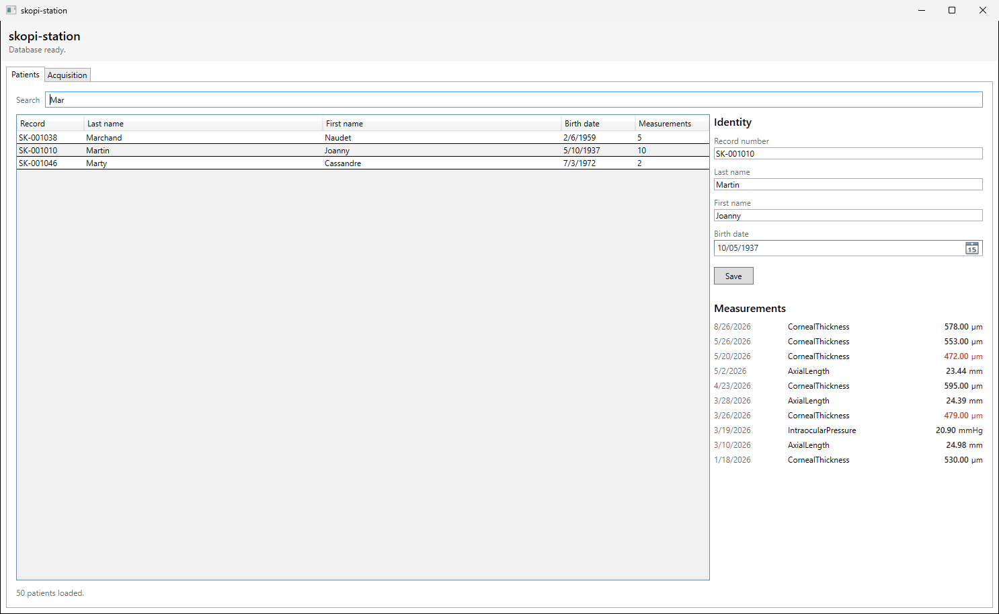
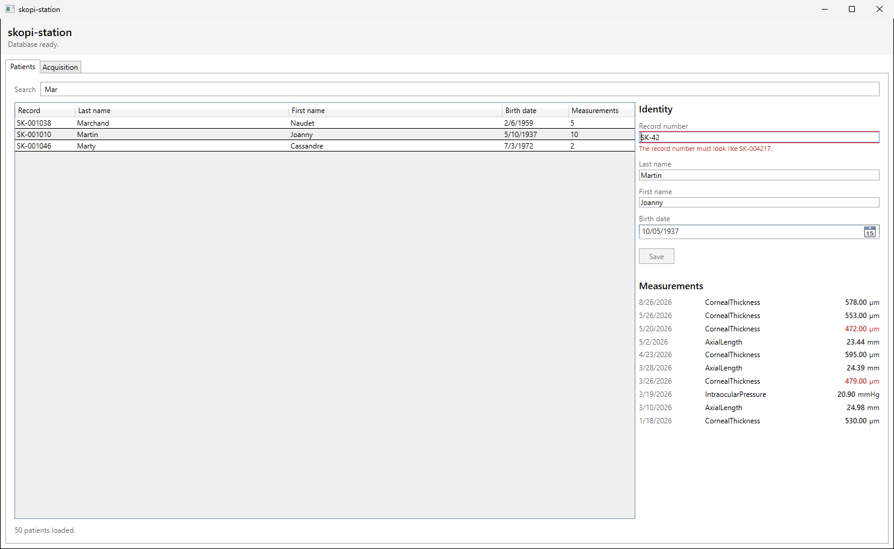
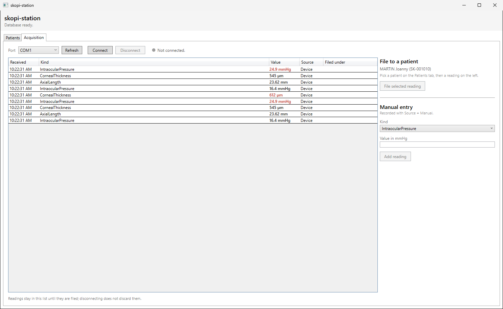

# skopi-station

Poste de saisie de mesures ophtalmologiques : application WPF de démonstration
technique sur .NET 8, Entity Framework Core et acquisition par liaison série.

## En bref

Si vous ne lisez qu'une chose, lisez ces trois décisions :

- [**Marshalling par `Dispatcher`**](#1-marshalling-vers-le-thread-ui--dispatcher-plutôt-quenablecollectionsynchronization) plutôt que `EnableCollectionSynchronization` : à quelques trames par seconde, le coût d'un saut est nul et tout se passe sur le thread UI, au lieu d'une discipline de verrouillage à tenir partout.
- [**`NumberStyles.Number` est un piège**](#parsing-numérique--pourquoi-pas-numberstylesnumber) : il autorise le séparateur de milliers, qui est la virgule en culture invariante. `2,5` devient `25` — une longueur axiale plausible, dans la plage de référence, stockée sans le moindre signal.
- [**Fermer le port avant d'attendre la boucle de lecture**](#déconnexion-série--fermer-le-port-avant-dattendre-la-boucle) : `SerialPort.BaseStream` ignore le `CancellationToken`, et l'ordre inverse gèle l'interface au clic sur *Disconnect*.

Les deux dernières sont des bugs réels, trouvés en exerçant le code et non en le relisant.

## Pourquoi ce projet

Transposer vers WPF des acquis XAML et MVVM constitués sous .NET MAUI, et y
ajouter l'intégration d'un appareil de mesure par liaison série. Les deux
plateformes partagent le langage de description d'interface, le binding et le
découpage vue / ViewModel, mais divergent sur le reste : `ICollectionView`, les
adorners de validation, le `Dispatcher` et la durée de vie des objets n'ont pas
d'équivalent direct en MAUI. Ce sont précisément ces points que le projet
exerce.

Le périmètre est volontairement réduit — deux écrans, terminés — parce que
l'objet du projet est la qualité de ce qui est fait, pas le nombre de
fonctionnalités.

## Captures d'écran

### Liste des patients

Recherche filtrant sur nom, prénom et numéro de dossier via `ICollectionView`,
tri par clic sur en-tête, détail et historique du patient sélectionné.



### Validation de l'identité

Numéro de dossier invalide : le message apparaît sous le champ et le bouton
*Save* reste désactivé tant que le formulaire porte une erreur.



### Acquisition

Mesures reçues en direct depuis l'appareil, celles qui sortent de la plage de
référence signalées en rouge, et rattachement au patient sélectionné.



## Structure de la solution

```
src/
  SkopiStation.Domain/     entités et règles métier, aucune dépendance externe
  SkopiStation.Data/       DbContext, configurations, migrations, dépôt
  SkopiStation.Devices/    abstraction série, parser de trames, implémentations
  SkopiStation.App/        WPF : vues, ViewModels, convertisseurs, App.xaml.cs
tests/
  SkopiStation.Tests/      tests unitaires
tools/
  SerialSimulator/         console émettant des trames sur un port série
  install-sqlexpress.ps1   installation scriptée de SQL Server Express
```

| Projet | Cible |
|---|---|
| `Domain`, `Data`, `Devices`, `SerialSimulator` | `net8.0` |
| `App`, `Tests` | `net8.0-windows` |

## Prérequis

- SDK .NET 8 : `winget install --id Microsoft.DotNet.SDK.8 --exact`
- Outils EF Core : `dotnet tool install --global dotnet-ef --version 8.*`
- SQL Server Express, instance `.\SQLEXPRESS` — voir ci-dessous

## Comment lancer

### Base de données

L'installation de SQL Server Express est scriptée dans
[`tools/install-sqlexpress.ps1`](tools/install-sqlexpress.ps1), à lancer depuis
une session PowerShell **administrateur** :

```powershell
Start-Process powershell -Verb RunAs -ArgumentList '-NoProfile','-ExecutionPolicy','Bypass',`
    '-File','tools\install-sqlexpress.ps1'
```

N'utilisez pas `winget install Microsoft.SQLServer.2022.Express` : son manifeste
épingle le bootstrapper 16.0.1000.6, que Microsoft rejette désormais côté
serveur avec le message « cette version du programme d'installation n'est plus
prise en charge ». Le script passe par le lien de téléchargement officiel, qui
sert une version courante. Il consigne également trois pièges rencontrés à
l'écriture, dont la limite de 260 caractères sur le chemin d'extraction.

SQL Server LocalDB convient également, tout comme un conteneur — le provider EF
Core est le même dans les trois cas, seule la chaîne de connexion change :

```
docker run -e ACCEPT_EULA=Y -e MSSQL_SA_PASSWORD=<motdepasse> \
  -p 1433:1433 -d mcr.microsoft.com/mssql/server:2022-latest
```

La chaîne de connexion se trouve dans `src/SkopiStation.App/appsettings.json`,
sous la clé `ConnectionStrings:SkopiStation`. Elle n'apparaît nulle part dans le
code.

### Application

```
dotnet run --project src/SkopiStation.App
```

Au premier démarrage, l'application applique les migrations et peuple la base.
Le second démarrage ne rejoue pas le peuplement.

### Appareil simulé par défaut

`appsettings.json` est livré avec `Device:Mode` sur `"Fake"` : l'écran
d'acquisition fonctionne sans appareil ni port série dès le premier lancement,
ce qui évite d'avoir à installer un pilote de ports virtuels pour voir tourner la
démonstration.

`FakeMeasurementDevice` émet un script de trames en mémoire, contenant
volontairement une mesure hors plage de référence et une trame malformée, pour
que les deux comportements soient visibles. Ces trames passent par exactement le
même chemin de code que celles d'un port série, rejet des trames invalides
compris.

Le mode réel est `"Serial"`. La valeur se surcharge par variable
d'environnement, sans modifier le fichier :

```powershell
$env:Device__Mode = 'Serial'; dotnet run --project src/SkopiStation.App
```

### Avec un port série réel

Sous Windows, [com0com](https://com0com.sourceforge.net/) crée une paire de
ports virtuels reliés entre eux — par exemple `COM3` et `COM4`. Le simulateur
écrit sur l'un, l'application lit sur l'autre :

```
dotnet run --project tools/SerialSimulator -- COM3 1000
```

L'argument optionnel est l'intervalle en millisecondes. Le simulateur émet
délibérément une trame malformée sur dix : unité incorrecte, champ manquant,
type inconnu ou valeur physiquement impossible. Passez `Device:Mode` à
`"Serial"`, lancez l'application, choisissez `COM4` dans la liste des ports et
cliquez sur *Connect*.

Sans arguments, le simulateur affiche la liste des ports disponibles.

### Migrations

Les migrations sont committées. Pour en ajouter une :

```
dotnet ef migrations add <Name> --project src/SkopiStation.Data --startup-project src/SkopiStation.App
```

Pour appliquer les migrations sans démarrer l'application :

```
dotnet ef database update --project src/SkopiStation.Data --startup-project src/SkopiStation.App
```

### Tests

```
dotnet test
```

## Décisions d'architecture

### 1. Marshalling vers le thread UI : `Dispatcher` plutôt qu'`EnableCollectionSynchronization`

Les mesures arrivent sur un thread de fond — un test le verrouille
explicitement, pour que la nécessité du marshalling ne devienne pas une
supposition. Muter une `ObservableCollection` liée depuis ce thread lève une
exception de cross-thread, et WPF offre deux réponses.

`BindingOperations.EnableCollectionSynchronization` déclare à WPF que la
collection peut être modifiée depuis d'autres threads et lui donne un verrou à
prendre pendant ses lectures. Rien n'est marshallé : `CollectionChanged`
continue d'être levé sur le thread producteur, et c'est la vue qui se
synchronise. C'est le bon choix quand le débit est élevé et que le coût d'un
saut de dispatcher par élément compterait. En contrepartie, **chaque** site de
mutation doit prendre le même verrou — une omission passe inaperçue en test et
se manifeste en production — et le travail de la vue se fait sur le thread
producteur, ce qui se marie mal avec le tri, le filtrage et la réentrance.

Le `Dispatcher` a été retenu. Un appareil de mesure émet quelques trames par
seconde au plus : le coût d'un `InvokeAsync` par mesure est sans objet à cette
cadence, et l'argument de performance qui justifierait l'autre approche ne
s'applique pas. En échange, **toutes** les mutations et toutes les notifications
dérivées se produisent sur le thread UI, ce qui élimine une classe entière de
problèmes de réentrance au lieu de la déplacer dans une discipline de
verrouillage qu'il faudrait tenir partout.

Le marshalling passe par une interface `IUiDispatcher`, avec une implémentation
WPF et une implémentation synchrone dans les tests — un hôte de test unitaire
n'a pas de `Dispatcher`. L'implémentation WPF exécute l'action en ligne quand
elle est déjà sur le bon thread, plutôt que de la mettre en file.

### 2. Durée de vie du `DbContext` : une fabrique, un contexte par opération

L'application injecte `IDbContextFactory<SkopiStationDbContext>` et crée un
contexte court pour chaque opération, jamais un contexte détenu par un
ViewModel. Une application de bureau n'a pas de portée de requête pour délimiter
la durée de vie : un contexte gardé vivant accumulerait indéfiniment des entités
suivies, servirait des données devenues obsolètes sans le savoir, et serait
sollicité depuis plusieurs threads alors que `DbContext` n'est pas conçu pour
cela.

### 3. Aucune logique dans le code-behind

Les fichiers `.xaml.cs` ne contiennent que `InitializeComponent()`. La seule
exception est `App.xaml.cs`, racine de composition : c'est lui qui construit
l'hôte, le démarre et affecte les `DataContext`. Les vues ne s'attribuent pas
leur propre contexte de données, ce qui garde la composition en un seul endroit
et rend les ViewModels instanciables sans WPF — condition de leur testabilité.

### 4. Validation par `INotifyDataErrorInfo`

La validation passe par `ObservableValidator`, qui implémente
`INotifyDataErrorInfo` et non l'`IDataErrorInfo` obsolète. La différence compte
ici : les erreurs sont publiées par propriété et de façon asynchrone via
`ErrorsChanged`, si bien qu'un champ peut être invalide sans que le binding ait
à faire transiter une chaîne, et que les commandes n'ont qu'à observer
`HasErrors`. Sont couverts les champs requis, le format du numéro de dossier,
la cohérence de la date de naissance et l'unicité du numéro de dossier.

#### Affichage des messages : hors de l'adorner

Publier une erreur ne suffit pas à la montrer. La façon canonique en WPF est un
`Validation.ErrorTemplate`, adorner dessiné par-dessus le champ fautif. À
l'usage, cet adorner s'est révélé inexploitable ici : le bouton *Save* se
désactivait correctement, mais aucun message n'apparaissait, et l'utilisateur se
retrouvait devant un bouton grisé sans explication. Le défaut n'était visible ni
à la compilation ni dans les tests unitaires, qui portent sur le ViewModel et
non sur le rendu ; il a fallu piloter l'interface réelle pour le constater.

Les messages sont donc rendus par des `TextBlock` placés dans le flux normal de
la mise en page, sous chaque champ, liés à l'élément de saisie :

```xml
<TextBox x:Name="RecordNumberBox" Text="{Binding RecordNumber, ...}" />
<TextBlock Text="{Binding ElementName=RecordNumberBox,
                          Path=(Validation.Errors)/ErrorContent}" />
```

La syntaxe `(Validation.Errors)/ErrorContent` — la barre oblique désignant
l'élément courant de la collection — évite l'indexation `[0]`, qui produit un
échec de binding dès que le champ redevient valide et que la collection se vide.
Les messages étant dans l'arbre visuel plutôt que dans la couche d'adorners, ils
sont aussi exposés aux outils d'accessibilité.

### 5. Un `IValueConverter`

`OutOfRangeBrushConverter` traduit en couleur l'indication de dépassement portée
par le modèle. La règle est de présentation, pas de domaine : le modèle dit déjà
si la valeur sort de sa plage de référence, et décider que cela se peint en
rouge appartient à la vue. Un convertisseur garde cette décision hors de
l'entité, hors du ViewModel, et hors du code-behind.

### 6. Asynchrone de bout en bout

`async`/`await` sans interruption, un `CancellationToken` sur la connexion à
l'appareil, aucun `.Result` ni `.Wait()` dans le dépôt. Les seuls `async void`
sont les gestionnaires d'événements WPF de `App.xaml.cs`, et le démarrage
asynchrone passe par l'événement `Startup` plutôt que par une surcharge
`async void OnStartup`, qui ne serait attendue par personne.

### Filtre et tri par `ICollectionView`

La vue est construite une fois par-dessus la collection et n'est jamais
remplacée. Taper dans le champ de recherche appelle `Refresh()`, cliquer sur un
en-tête de colonne ajoute une `SortDescription` : la collection n'est pas
reconstruite à chaque frappe. Un test conserve une référence sur la vue à
travers plusieurs recherches successives — une collection reconstruite en
produirait une nouvelle.

### Couche métier indépendante de la plateforme

`Domain`, `Data` et `Devices` ciblent `net8.0` et ne référencent rien de
Windows. Seuls `App` et `Tests` ciblent `net8.0-windows`, les premiers parce
qu'ils sont WPF, les seconds parce qu'ils exercent des ViewModels qui utilisent
`ICollectionView`. La conséquence pratique est que le parser de trames, les
règles de plage et tout l'accès aux données se compilent et se testent sans WPF.

### Migrations : pas de `IDesignTimeDbContextFactory`

Les outils EF cherchent une méthode statique `CreateHostBuilder` sur le type qui
déclare le point d'entrée de l'assembly de démarrage. Pour une application WPF,
ce type est `App` : en l'y exposant, `dotnet ef` résout le `DbContext` depuis le
conteneur réel de l'application. Une fabrique de conception aurait dupliqué la
chaîne de connexion — c'est d'ailleurs sous cette forme qu'elle existait au
départ, avec une chaîne LocalDB écrite en dur.

### Valeur impossible et valeur hors plage

Chaque type de mesure porte deux intervalles, qui répondent à deux questions
différentes et ne doivent pas être confondus.

`ReferenceRange` est la plage de référence clinique — 10 à 21 mmHg pour la
pression intraoculaire. Une valeur en dehors est une **mesure valide** : elle
est enregistrée, et signalée par `IsOutOfRange`. C'est précisément le genre de
valeur qu'on veut voir, pas jeter.

`PlausibleRange` est l'enveloppe de ce qu'un appareil en état de marche peut
physiquement rapporter — 1 à 80 mmHg. Une valeur en dehors n'est pas une mesure
mais une trame corrompue ou un appareil défaillant : elle est **rejetée** par le
parser, journalisée, et n'atteint jamais la base.

L'unité reçue est vérifiée de la même façon : une pression rapportée en kPa
signifie que l'appareil n'est pas configuré comme prévu, et enregistrer le
nombre en silence serait pire que de laisser tomber la trame.

### Parsing numérique : pourquoi pas `NumberStyles.Number`

Les valeurs des trames sont lues avec
`NumberStyles.AllowDecimalPoint | NumberStyles.AllowLeadingSign`, et non avec le
`NumberStyles.Number` qu'on écrit par réflexe. `Number` inclut `AllowThousands`,
et le séparateur de milliers de la culture invariante est **la virgule**. Une
trame contenant `2,5` est alors lue comme `25` sans la moindre erreur.

Sur une longueur axiale, `25 mm` est physiquement plausible *et* dans la plage
de référence. La valeur fausse traverse donc toutes les vérifications et se
retrouve en base, attribuée à un patient, sans rien pour la distinguer d'une
mesure correcte. C'est plus grave qu'un plantage : un plantage se voit et se
corrige, une donnée fausse et silencieuse se propage. Un appareil configuré en
locale française, ou une trame corrompue sur un octet, suffit à la produire.

La saisie manuelle applique la même règle et la même enveloppe de plausibilité :
une valeur tapée ne peut pas entrer par une porte qu'une trame reçue n'aurait
pas franchie.

### Déconnexion série : fermer le port avant d'attendre la boucle

`SerialPort.BaseStream` **n'observe pas le `CancellationToken`**. Annuler le
jeton puis attendre la boucle de lecture ne suffit donc pas : le `ReadLineAsync`
en cours reste bloqué jusqu'à ce qu'un octet arrive — c'est-à-dire indéfiniment
si l'appareil s'est tu ou a été débranché. `DisconnectAsync` gelait, et avec lui
l'interface au clic sur *Disconnect*.

`DisconnectAsync` ferme donc le port **avant** d'attendre la boucle : c'est la
fermeture qui avorte la lecture en cours et permet à la boucle de se terminer.
La boucle traite l'erreur d'entrée-sortie qui en résulte comme une sortie
normale dès lors que l'annulation a été demandée, faute de quoi un arrêt
volontaire laisserait l'appareil en état `Faulted`.

Les mesures déjà reçues ne sont pas effacées par une déconnexion : elles
appartiennent à l'opérateur, et un câble qui bouge est le pire moment pour les
perdre.

### FluentAssertions 7.2.2

Dernière version publiée sous licence Apache 2.0. La version 8 est passée sous
licence commerciale ; la 7.2.2 est donc épinglée dans
`Directory.Packages.props`, avec la raison en commentaire à côté.

### Ce qui n'est pas couvert par les tests

L'**ouverture du port série lui-même** n'est pas testée automatiquement : cela
demanderait une paire de ports virtuels (`com0com`), donc un pilote et une
installation privilégiée sur la machine de test comme sur le runner de CI.

Le contournement tient en deux parties. La boucle de lecture — qui porte
l'essentiel de la logique : découpage en lignes, rejet des trames invalides,
annulation — est exercée sur un `TextReader` via un `PumpingDevice` défini dans
le projet de tests, qui dérive de `MeasurementDeviceBase` et emprunte exactement
le même `PumpAsync` que l'implémentation série. Le reste — ouverture réelle,
échec sur un port inexistant, déconnexion sans blocage — a été vérifié
manuellement avec un harnais jetable contre un port réel. C'est ce harnais qui a
révélé le blocage décrit plus haut, qu'aucun test unitaire n'aurait vu.

De même, l'absence d'exception de cross-thread a été vérifiée en pilotant
l'interface réelle par UI Automation, l'appareil simulé connecté : les tests
unitaires marshallent en ligne et ne pourraient pas la constater.

## Données

Toutes les données sont **entièrement synthétiques**, générées par
[Bogus](https://github.com/bchavez/Bogus) au premier démarrage : une cinquantaine
de patients et environ trois cents mesures. **Aucune donnée réelle de patient
n'est utilisée, saisie ou stockée**, et le dépôt n'en contient aucune.

Le jeu de données est reproductible d'une exécution et d'une machine à l'autre,
ce qui suppose deux choses et non une seule : une graine fixe **et** une date de
référence fixe. Bogus calcule ses dates relatives depuis `DateTime.Now`, si bien
que la graine seule laisserait les dates dériver à chaque exécution. Un test
génère le jeu deux fois et compare l'intégralité des champs.

## Limites et suite

Ce qui manquerait pour un usage réel, au-delà du périmètre annoncé :

- **Journal d'audit des accès.** Rien ne trace qui a consulté ou modifié quel
  dossier. Sur des données de santé, la traçabilité des consultations est une
  exigence à part entière, distincte du versionnement des écritures.
- **Chiffrement au repos.** La base n'est pas chiffrée. Il faudrait au minimum
  Transparent Data Encryption, et vraisemblablement `Always Encrypted` sur les
  colonnes identifiantes, avec la gestion de clés que cela implique.
- **Authentification et habilitations.** L'application n'a ni utilisateurs ni
  rôles ; quiconque la lance voit tous les dossiers.
- **Reprise après déconnexion prolongée.** La déconnexion est propre et les
  mesures déjà reçues sont conservées, mais il n'y a ni reconnexion automatique,
  ni file d'attente persistante des mesures non rattachées : elles vivent en
  mémoire jusqu'à ce qu'on les enregistre. Une fermeture de l'application les
  perd.
- **Ouverture du port série non couverte par les tests**, pour la raison
  détaillée plus haut. Une CI complète demanderait un port virtuel installé sur
  le runner.
- **Concurrence.** Le modèle n'a pas de jeton de concurrence : deux instances
  modifiant le même patient s'écraseraient sans conflit détecté.

## Avertissement

Les plages de référence utilisées pour signaler une mesure hors norme sont
**indicatives, choisies pour la démonstration, et non cliniquement validées**.
Cette application est une démonstration technique et n'a pas vocation à un usage
clinique.
